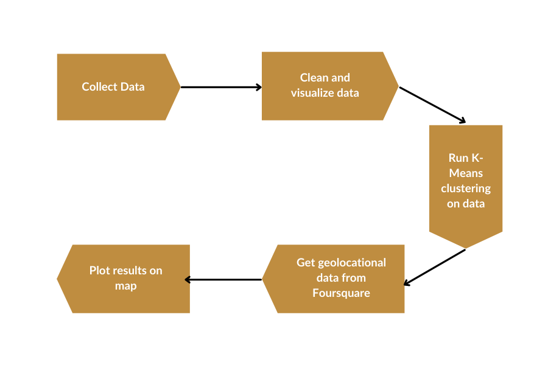
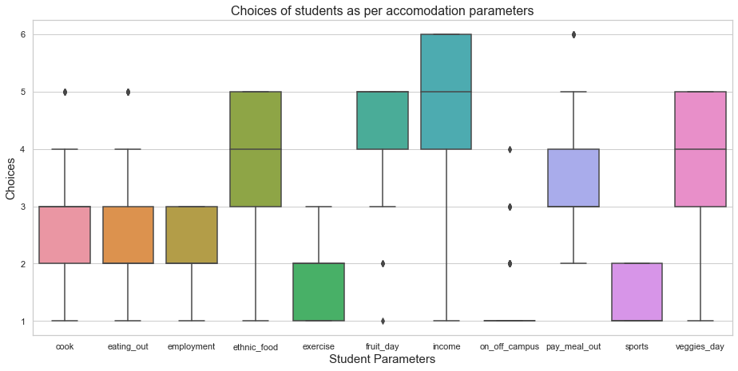
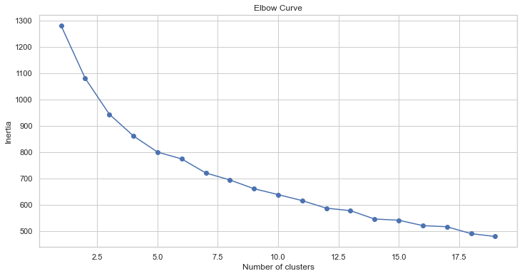
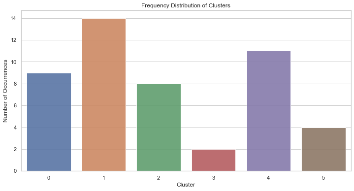
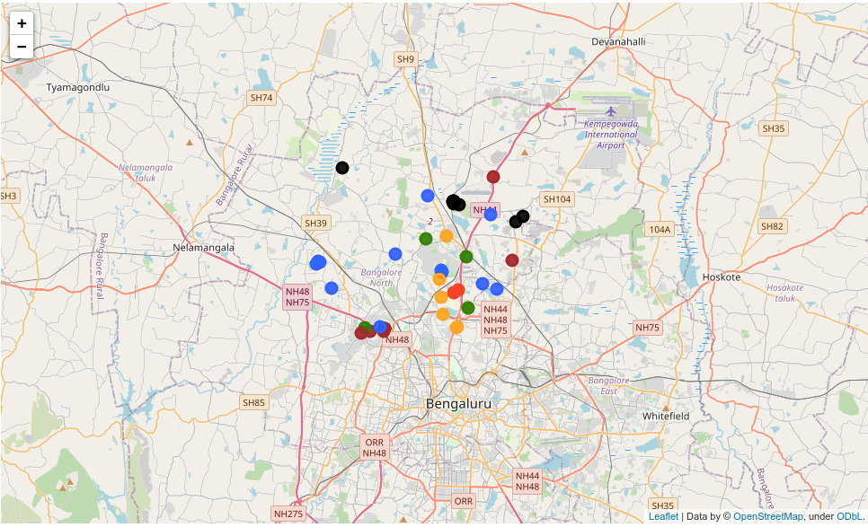

# Objective 
This project involves the use of K-Means Clustering to find the best accommodation for students in Bangalore (or any other city of your choice) by classifying accommodation for incoming students on the basis of their preferences on amenities, budget and proximity to the location.

# Project Stages

### The project consists of the following stages: 

### Steps
1. #### Fetch Datasets from the relevant locations (Data Collection)

2. #### Clean the Datasets to prepare them for analysis. (Data Cleaning via Pandas)

3. #### Visualise the data using boxplots. (Using Matplotlib /Seaborn /Pandas) 
    
   
     
   
   

4. #### Fetch Geolocational Data from the Foursquare API. (REST APIs) 

5. #### Use K-Means Clustering to cluster the locations (Using ScikitLearn)  

   

6. #### Present findings on a map. (Using Folium/Seaborn)
    
   
   
   

# Insights from data - Case Study
### What sort of person will live in what cluster? Are there any particular criteria/demographics that go well together?

### Cluster 0 and 5 (Red and Yellow Dots)

    More the restaurants in an area, more will be the gyms and fitness centers. (Cluster 0)
    Major markets and shops are closer to cluster 0
    High income groups live around cluster 0

### Cluster 1 and 2 (Green and Blue Dots)

    Foodies should consider cluster 1 and 2, if they don't want gym freaks around them
    Cluster 1 and 2 are budget-friendly dining-out options on weekends
    Suitable for both high and low income groups

### Cluster 3 (Black Dots)

    Cluster 3 are posh areas with less restaurants and some gyms. But, you have to travel some distance to go to markets
    Since, these areas are far from markets, they are cheaper to live
    Suitable for average income groups

### Cluster 4 (Brown/Maroon Dots)

    No gyms/fitness centers, all you do is eat, eat and eat

### References
- For test data, https://www.kaggle.com/borapajo/food-choices
- K-means clustering, https://scikit-learn.org/stable/modules/generated/sklearn.cluster.KMeans.html
- Foursquare API, https://developer.foursquare.com/docs/places-api/getting-started/
- Folium for visualising map https://python-visualization.github.io/folium/modules.html
